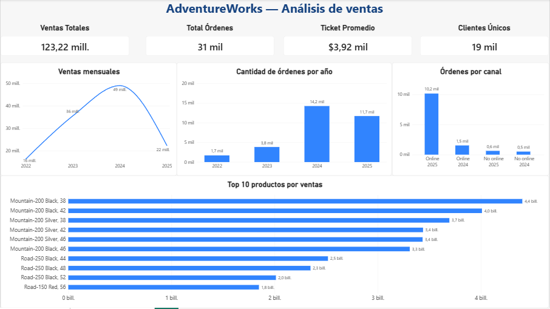
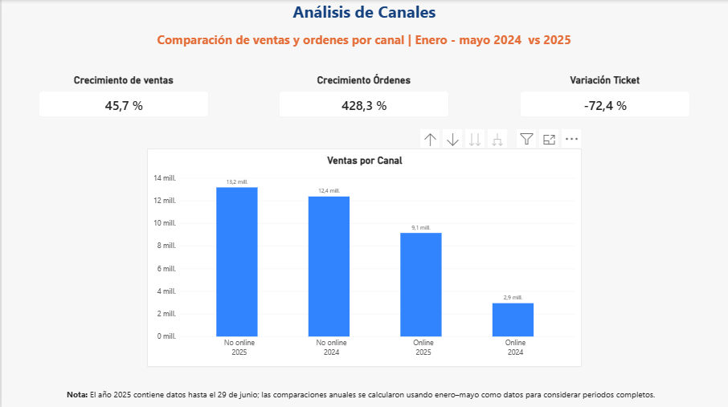

# Proyecto: Análisis de ventas — AdventureWorks2025

## Objetivo

Realizar un análisis exploratorio de las ventas de AdventureWorks2025 utilizando SQL, Python y Power BI, con el objetivo de identificar patrones en la evolución de las ventas, comportamiento de los canales, ticket promedio y productos con mayores ventas.

## Herramientas utilizadas

- SQL
- Python
- Pandas
- Power BI
- Git / GitHub

## Datos utilizados

El análisis utiliza información de:

- Órdenes de venta
- Detalle de órdenes
- Productos

El periodo disponible en los datos abarca desde mayo de 2022 hasta junio de 2025.

> **Nota:** junio de 2025 contiene datos parciales. Por este motivo, las comparaciones entre 2024 y 2025 utilizan el periodo enero–mayo.

## Proceso de análisis

### 1. SQL

Se realizaron consultas para explorar y analizar los datos, incluyendo:

- Análisis de órdenes y ventas.
- Evolución de ventas por periodo.
- Análisis por canal.
- Identificación de productos con mayores ventas.
- Análisis de clientes.
- Uso de funciones de agregación y funciones de ventana.

### 2. Python

Se utilizó Python con Pandas para:

- Cargar los archivos CSV.
- Revisar y preparar los datos.
- Realizar agrupaciones y cálculos.
- Calcular indicadores de ventas, órdenes y ticket promedio.
- Analizar ventas, canales y productos.

### 3. Power BI

Se construyó un dashboard para visualizar:

- Ventas totales.
- Número de órdenes.
- Ticket promedio.
- Clientes únicos.
- Evolución de las ventas.
- Órdenes por canal.
- Productos con mayores ventas.
- Comparación de canales entre 2024 y 2025.

## Principales insights

### 1. Crecimiento de ventas acompañado por un fuerte aumento de las órdenes

Entre enero–mayo de 2024 y el mismo periodo de 2025:

- **Ventas:** Aumentaron 45.7%
- **Órdenes:** Aumentaron 428.3%
- **Ticket promedio:** Disminuyó 72.4%

Las ventas aumentaron 45.7%, mientras que el número de órdenes creció 428.3%. Al mismo tiempo, el ticket promedio disminuyó 72.4%.

### 2. El crecimiento de las órdenes estuvo concentrado en el canal online

Entre enero–mayo de 2024 y enero–mayo de 2025:

- **Órdenes online:** Aumentaron 563.4%
- **Órdenes no online:** Aumentaron 23.3%
- **Ventas online:** Aumentaron 210.6%
- **Ventas no online:** Aumentaron 6.5%

El canal online presentó el mayor crecimiento tanto en número de órdenes como en ventas durante el periodo analizado.

### 3. El canal online aumentó sus órdenes, pero redujo su ticket promedio

El ticket promedio online pasó de:

**$1,921.69 → $899.73**

Variación:

**−53.2%**

En el canal no online:

**$24,197.88 → $20,900.83**

Variación:

**−13.6%**

El fuerte crecimiento de las órdenes online estuvo acompañado por una reducción del monto promedio por orden.

### 4. Una parte importante de las ventas se concentra en pocos productos

Los seis modelos identificados de la línea **Mountain-200** generaron aproximadamente **$22.29 millones**, equivalentes a alrededor del **20.3% del LineTotal**.

Además, los 10 productos con mayores ventas representaron aproximadamente el **28.2% del LineTotal**.

Esto muestra que una parte importante de las ventas está concentrada en un grupo reducido de productos.

## Dashboard

### Página 1 — Análisis de ventas

### Página 2 — Análisis de canales

## Conclusiones

Entre enero–mayo de 2024 y enero–mayo de 2025, las ventas aumentaron 45.7%, acompañadas por un crecimiento mucho mayor en el número de órdenes y una disminución del ticket promedio.

El canal online concentró gran parte del crecimiento observado en las órdenes y también presentó un crecimiento importante en ventas. Sin embargo, su ticket promedio disminuyó durante el periodo analizado.

Finalmente, se observa una concentración de las ventas en determinados productos, destacando la participación de los modelos Mountain-200.